<b>Python version:</b>  >3.6<br/>
<b>External Packages:</b> pandas, matplotlib, sklearn, numpy<br/>
<b>Last update:</b> 31st Jan 2018

<b>About this project:</b> This is an academic project, submitted as a part of semester credits in "Machine Learning by <a href="http://pages.di.unipi.it/micheli/">Prof. Micheli </a>" at Università di Pisa. 


<a id='top'></a>
# *Demonstration of Perceptron Model*

In this notebook, the perceptron model is demonstrated and tested. The model is functional perceptron model is developed from the scratch. The aim was to implement our understanidng of perceptron model and to test the effect of various hyper-parameters. It is a very flexible model with support of classification as well as regression tasks. This model supports hyper parameters such as learning rate, momentum, regularization, weight initialization types etc. Almost every parameter can be passed through grid search and can be tuned. <br>
<br>
Grid search with cross validation is also developed in addition, to try different combinations of hyperparameters in order to do classification/regression tasks. Grid search returns the log(if log=True) and the list of best hyperparameters (length depends upon 'topn' function parameter). The hyper parameters are chosen according to either least trainingLoss or least validationLoss or the mean of two. 


## Table of Contents

1. [Experiments on Monk 1 dataset](#monk1)
    1. [Grid Search on Monk 1](#monk1gs)
    2. [Training Monk1 with best parameters obtained](#monk1train)
    3. [Testing Monk1](#monk1test)
    4. [Training monk1 with best parameters obtained, with cross validation](#monk1cv)
2. [Experiments on Monk 2 dataset](#monk2)
    1. [Grid Search on Monk 2](#monk2gs)
    2. [Training Monk 2 with best parameters obtained](#monk2train)
    3. [Testing Monk 2](#monk2test)
    4. [Training monk 3 with best parameters obtained, with cross validation](#monk2cv)
3. [Experiments on Monk 3 dataset](#monk3)
    1. [Grid Search on Monk 3](#monk3gs)
    2. [Training Monk 3 with best parameters obtained](#monk3train)
    3. [Testing Monk 3](#monk3test)
    4. [Training monk 3 with best parameters obtained, with cross validation](#monk3cv)
        
4. [Regression Problem | ML Cup](#mlcup)
    1. [Grid search on regression problem](#mlcupgs)
    2. [Training with with best parameters obtained](#mlcuptrain)
    3. [Training with cross validation, with best parameters](#mlcupcv)
    4. [Blind Test](#blindtest)


```python
import pdb, time
import numpy as np
import pandas as pd
import matplotlib.pyplot as plt
from sklearn.model_selection import train_test_split
%matplotlib inline
import sklearn.preprocessing as preprocessing
from itertools import product
```


```python
from source.perceptron import perceptron
from source.abGridSearchCV import abGridSearchCV
from source.loadData import loadMonk
```

<a id='monk1'></a>
# 0. Monk Datasets ([to top](#top))

Attributes with granularity:
a1: 1, 2, 3
a2: 1, 2, 3
a3: 1, 2
a4: 1, 2, 3
a5: 1, 2, 3, 4
a6: 1, 2
target: 0, 1

#### In Monk 1 Dataset, the targets are 1 if (a1==a2) or (a5==1)

#### In Monk 2 Dataset, the targets are 1 if exactly two of {a1 = 1, a2 = 1, a3 = 1, a4 = 1, a5 = 1, a6 = 1} are correct. 

#### In Monk 3 Dataset, targets are 1 if (a5 = 3 and a4 = 1) or (a5 /= 4 and a2 /= 3).

```
Carnegie Mellon University Pittsburgh, PA 15213, USA E-mail: thrun '@' cs.cmu. edu.
```

<a id='monk1'></a>
# 1. Experiments on Monk 1 ([to top](#top))


```python
trainData, trainLabels=loadMonk(1, 'train', encodeLabel=False)
```

<a id='monk1gs'></a>
### A. Grid Search on Monk1 ([to top](#top))

ETA is learning rate,
LAMBDA is regularization parameter,
ALPHA is momentum,


```python
defaultParameters={
    'hiddenUnits':3,
    'randomSeed':0,
    'activation':'sigm',
    'epochs':500,
    'ETA':0.4,
    'LAMBDA':0.0,
    'loss':"MEE",
    'ALPHA':0.9,
    'weightInitialization':'xav',
    'regression':False,
    'earlyStopping':True,
    'tolerance':1e-3,
    'patience':20
}

parameterGridForModelSelection={
#     'randomSeed':[0, 20],
    'hiddenUnits':[4, 16],
    'activation':['sigm', 'relu', 'tanh'],
    'ETA':[0.1, 0.2, 0.3, 0.5, 0.7,0.9],
    'LAMBDA':[0.001,0.01],
    'ALPHA':[0.2, 0.5, 0.7, 0.9],
#     'weightInitialization':['xav', 'he', 'type1'],
#     'epochs':[300, 500]
}
```


```python
top5BestParams=abGridSearchCV(defaultParameters, parameterGridForModelSelection, trainData, trainLabels, winnerCriteria="meanLosses", validationSplit=0.3, log=False, topn=5)
```

    iteration 21/500        287/288


```python
top5BestParams
```


    [{'meanLosses': 0.080383052475397454,
      'meanTrainingLoss': 0.074816536086853846,
      'meanValidationLoss': 0.085949568863941075,
      'params': {'ALPHA': 0.5,
       'ETA': 0.3,
       'LAMBDA': 0.001,
       'activation': 'sigm',
       'epochs': 413,
       'hiddenUnits': 4}},
     {'meanLosses': 0.081376470456553995,
      'meanTrainingLoss': 0.07491194201533527,
      'meanValidationLoss': 0.087840998897772707,
      'params': {'ALPHA': 0.9,
       'ETA': 0.2,
       'LAMBDA': 0.001,
       'activation': 'sigm',
       'epochs': 477,
       'hiddenUnits': 4}},
     {'meanLosses': 0.082419646642824682,
      'meanTrainingLoss': 0.07471128658272097,
      'meanValidationLoss': 0.090128006702928393,
      'params': {'ALPHA': 0.7,
       'ETA': 0.5,
       'LAMBDA': 0.001,
       'activation': 'sigm',
       'epochs': 352,
       'hiddenUnits': 4}},
     {'meanLosses': 0.084242516160344783,
      'meanTrainingLoss': 0.072312472974062944,
      'meanValidationLoss': 0.096172559346626621,
      'params': {'ALPHA': 0.9,
       'ETA': 0.7,
       'LAMBDA': 0.001,
       'activation': 'sigm',
       'epochs': 299,
       'hiddenUnits': 4}},
     {'meanLosses': 0.084373773845286978,
      'meanTrainingLoss': 0.079003026519703604,
      'meanValidationLoss': 0.089744521170870353,
      'params': {'ALPHA': 0.7,
       'ETA': 0.2,
       'LAMBDA': 0.001,
       'activation': 'sigm',
       'epochs': 476,
       'hiddenUnits': 4}}]


```python
bestParams=top5BestParams[0]['params']
defaultParameters['earlyStopping']=False
```


```python
bestParams
```


    {'ALPHA': 0.5,
     'ETA': 0.3,
     'LAMBDA': 0.001,
     'activation': 'sigm',
     'epochs': 413,
     'hiddenUnits': 4}


<a id='monk1train'></a>
### B. Training Monk 1 with best parameters obtained ([to top](#top))

<h5> For fun.. testing a neural network initialized with zero weights


```python
x=perceptron(**defaultParameters)
x.set_params(**bestParams)
x.set_params(weightInitialization='zero')
x.fit(trainData, trainLabels)
```

    iteration 413/413


```python
plt.plot(x.losses)
```


    [<matplotlib.lines.Line2D at 0x7f725519ffd0>]


```python
plt.plot(x.accuracies)
```


    [<matplotlib.lines.Line2D at 0x7f7255100080>]


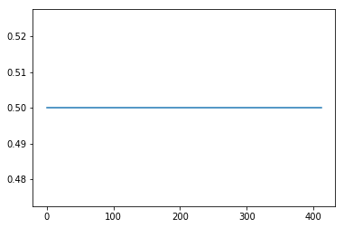


```python
testData, testLabels=loadMonk(1, 'test', encodeLabel=False)
testResults, testAccuracy=x.predict(testData, testLabels, acc_=True)
```


```python
testAccuracy
```


    0.5


<h5> fun's over!!!; now let's train our network with best params


```python
x=perceptron(**defaultParameters)
x.set_params(**bestParams)
x.fit(trainData, trainLabels)
```

    iteration 413/413


```python
plt.plot(x.losses)
```


    [<matplotlib.lines.Line2D at 0x7f72550d83c8>]


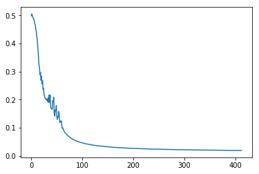


```python
plt.plot(x.accuracies)
```


    [<matplotlib.lines.Line2D at 0x7f725502dcf8>]


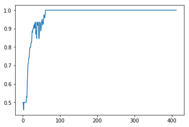


<a id='monk1test'></a>
### B. Testing Monk 1 trained model([to top](#top))


```python
testData, testLabels=loadMonk(1, 'test', encodeLabel=False)
```


```python
testResults, testAccuracy=x.predict(testData, testLabels, acc_=True)
```


```python
testAccuracy
```


    1.0


<a id='monk1cv'></a>
### C. Training Monk 1 with best parameters obtained, with cross validation ([to top](#top))


```python
trainData, trainLabels=loadMonk(1, 'train', encodeLabel=False)
trainData, validationData, trainLabels, validationLabels=train_test_split(trainData, trainLabels, test_size=0.1)
```


```python
x=perceptron(**defaultParameters)
x.set_params(**bestParams)
x.fit(trainData, trainLabels, validationFeatures=validationData, validationLabels=validationLabels)
```

    iteration 413/413


```python
plt.plot(x.accuracies)
plt.plot(x.validationAccuracies)
```


    [<matplotlib.lines.Line2D at 0x7f7255078400>]


```python
plt.plot(x.losses)
plt.plot(x.validationLosses)
```


    [<matplotlib.lines.Line2D at 0x7f71bac6a748>]


<a id='monk2'></a>
# 2. Monk 2 ([to top](#top))


```python
trainData, trainLabels=loadMonk(2, 'train', encodeLabel=False)
```

<a id='monk2gs'></a>
### A. Grid Search on Monk 2 ([to top](#top))


```python
defaultParameters['earlyStopping']=True
top5BestParams=abGridSearchCV(defaultParameters, parameterGridForModelSelection, trainData, trainLabels, winnerCriteria="meanLosses", validationSplit=0.3, log=False, topn=5)
```

    iteration 21/500        287/288


```python
top5BestParams
```


    [{'meanLosses': 0.073474774082772629,
      'meanTrainingLoss': 0.071237613323866827,
      'meanValidationLoss': 0.07571193484167843,
      'params': {'ALPHA': 0.9,
       'ETA': 0.3,
       'LAMBDA': 0.001,
       'activation': 'sigm',
       'epochs': 372,
       'hiddenUnits': 4}},
     {'meanLosses': 0.077636512762921425,
      'meanTrainingLoss': 0.074975553679050108,
      'meanValidationLoss': 0.080297471846792742,
      'params': {'ALPHA': 0.7,
       'ETA': 0.3,
       'LAMBDA': 0.001,
       'activation': 'sigm',
       'epochs': 376,
       'hiddenUnits': 4}},
     {'meanLosses': 0.085343996795136656,
      'meanTrainingLoss': 0.082409373163706043,
      'meanValidationLoss': 0.08827862042656727,
      'params': {'ALPHA': 0.5,
       'ETA': 0.3,
       'LAMBDA': 0.001,
       'activation': 'sigm',
       'epochs': 384,
       'hiddenUnits': 4}},
     {'meanLosses': 0.087062271878194264,
      'meanTrainingLoss': 0.083728924138565419,
      'meanValidationLoss': 0.090395619617823095,
      'params': {'ALPHA': 0.9,
       'ETA': 0.5,
       'LAMBDA': 0.001,
       'activation': 'sigm',
       'epochs': 315,
       'hiddenUnits': 4}},
     {'meanLosses': 0.089620261402815996,
      'meanTrainingLoss': 0.085772966902846179,
      'meanValidationLoss': 0.093467555902785812,
      'params': {'ALPHA': 0.7,
       'ETA': 0.5,
       'LAMBDA': 0.001,
       'activation': 'sigm',
       'epochs': 321,
       'hiddenUnits': 4}}]


```python
defaultParameters['earlyStopping']=False
bestParams=top5BestParams[0]['params']
```

<a id='monk2train'></a>
### B. Training Monk 2 with the best parameters obtained([to top](#top))


```python
x=perceptron(**defaultParameters)
x.set_params(**bestParams)
x.fit(trainData, trainLabels)
```

    iteration 372/372


```python
plt.plot(x.accuracies)
```


    [<matplotlib.lines.Line2D at 0x7fe23a8dfcc0>]


```python
plt.plot(x.losses)
```


    [<matplotlib.lines.Line2D at 0x7fe2379cf0b8>]


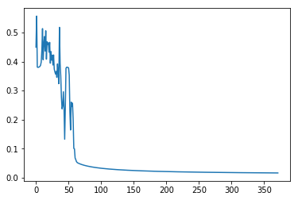


<a id='monk2test'></a>
### C. Testing Monk 2([to top](#top))


```python
# to see if a model trained on Monk2 can classify Monk 1
testData, testLabels=loadMonk(1, 'test', encodeLabel=False)
testResults, testAccuracy=x.predict(testData, testLabels, acc_=True)
```


```python
testAccuracy #of Monk1 on model trained on monk2
```


    0.43981481481481483


```python
#getting serious now ;D
testData, testLabels=loadMonk(2, 'test', encodeLabel=False)
testResults, testAccuracy=x.predict(testData, testLabels, acc_=True)
```


```python
testAccuracy #yayy!
```


    1.0


<a id='monk2cv'></a>
### D. Training Monk 2 with the best parameters and with cross validation([to top](#top))


```python
trainData, trainLabels=loadMonk(2, 'train', encodeLabel=False)
trainData, validationData, trainLabels, validationLabels=train_test_split(trainData, trainLabels, test_size=0.1)
x=perceptron(**defaultParameters)
x.set_params(**bestParams)
x.fit(trainData, trainLabels, validationFeatures=validationData, validationLabels=validationLabels)
```

    iteration 372/372


```python
plt.plot(x.accuracies)
plt.plot(x.validationAccuracies)
```


    [<matplotlib.lines.Line2D at 0x7fe23a8c4c50>]


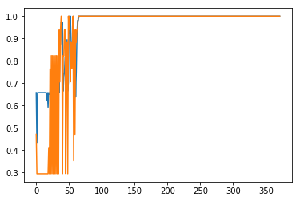


```python
plt.plot(x.losses)
plt.plot(x.validationLosses)
```


    [<matplotlib.lines.Line2D at 0x7fe2379679e8>]


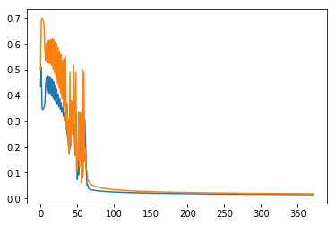


<a id='monk3'></a>
# 3. Monk 3 ([to top](#top))


```python
trainData, trainLabels=loadMonk(3, 'train', encodeLabel=False)
```

<a id='monk3gs'></a>
### A. Grid Search on Monk 3 ([to top](#top))


```python
defaultParameters['earlyStopping']=True
top5BestParams=abGridSearchCV(defaultParameters, parameterGridForModelSelection, trainData, trainLabels, winnerCriteria="meanLosses", validationSplit=0.3, log=False, topn=5)
defaultParameters['earlyStopping']=False
```

    iteration 21/500        287/288


```python
top5BestParams
```


    [{'meanLosses': 0.073088388910850718,
      'meanTrainingLoss': 0.05514765608540876,
      'meanValidationLoss': 0.09102912173629267,
      'params': {'ALPHA': 0.9,
       'ETA': 0.7,
       'LAMBDA': 0.001,
       'activation': 'sigm',
       'epochs': 363,
       'hiddenUnits': 4}},
     {'meanLosses': 0.074405958835380953,
      'meanTrainingLoss': 0.06467883672931346,
      'meanValidationLoss': 0.084133080941448432,
      'params': {'ALPHA': 0.9,
       'ETA': 0.3,
       'LAMBDA': 0.001,
       'activation': 'sigm',
       'epochs': 382,
       'hiddenUnits': 4}},
     {'meanLosses': 0.076441115686924674,
      'meanTrainingLoss': 0.065130088221405716,
      'meanValidationLoss': 0.087752143152443632,
      'params': {'ALPHA': 0.7,
       'ETA': 0.3,
       'LAMBDA': 0.001,
       'activation': 'sigm',
       'epochs': 396,
       'hiddenUnits': 4}},
     {'meanLosses': 0.082981430081672025,
      'meanTrainingLoss': 0.069712231732486349,
      'meanValidationLoss': 0.096250628430857715,
      'params': {'ALPHA': 0.5,
       'ETA': 0.3,
       'LAMBDA': 0.001,
       'activation': 'sigm',
       'epochs': 375,
       'hiddenUnits': 4}},
     {'meanLosses': 0.083468995709044772,
      'meanTrainingLoss': 0.073056830286287025,
      'meanValidationLoss': 0.093881161131802518,
      'params': {'ALPHA': 0.2,
       'ETA': 0.9,
       'LAMBDA': 0.001,
       'activation': 'sigm',
       'epochs': 363,
       'hiddenUnits': 4}}]


```python
bestParams=top5BestParams[0]['params']
```

<a id='monk3train'></a>
### B. Training Monk 3 with the best parameters obtained([to top](#top))


```python
x=perceptron(**defaultParameters)
x.set_params(**bestParams)
x.fit(trainData, trainLabels)
```

    iteration 363/363


```python
plt.plot(x.accuracies)
```


    [<matplotlib.lines.Line2D at 0x7fe23789e080>]


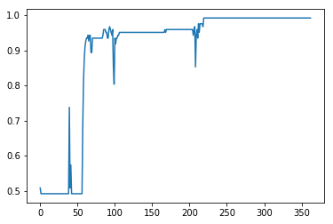


```python
plt.plot(x.losses)
```


    [<matplotlib.lines.Line2D at 0x7fe233163668>]


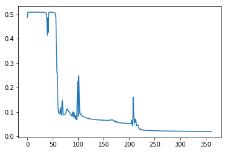


<a id='monk3test'></a>
### C. Testing Monk 3 trained Model([to top](#top))


```python
testData, testLabels=loadMonk(3, 'test', encodeLabel=False)
testResults, testAccuracy=x.predict(testData, testLabels, acc_=True)
```


```python
testAccuracy
```


    0.94444444444444442


<a id='monk3cv'></a>
### D. Training monk 3 with the best parameters and with cross validation([to top](#top))


```python
trainData, trainLabels=loadMonk(3, 'train', encodeLabel=False)
trainData, validationData, trainLabels, validationLabels=train_test_split(trainData, trainLabels, test_size=0.2)
x=perceptron(**defaultParameters)
x.set_params(**bestParams)
x.fit(trainData, trainLabels, validationFeatures=validationData, validationLabels=validationLabels)
```

    iteration 363/363


```python
plt.plot(x.accuracies)
plt.plot(x.validationAccuracies)
```


    [<matplotlib.lines.Line2D at 0x7fe23783ef98>]


```python
plt.plot(x.losses)
plt.plot(x.validationLosses)
```


    [<matplotlib.lines.Line2D at 0x7fe23315a518>]


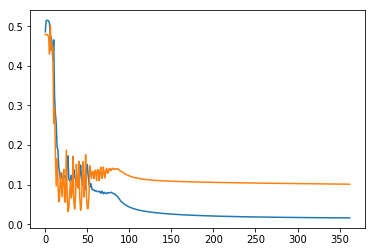


<a id='mlcup'></a>
# 4. Regression Problem | ML Cup([to top](#top))

The dataset (ML Cup) contains 10 features and 2 labels. Both features and lables are continuous values. 
The dataset contains 1015 rows for training. The blind test data contains 315 unlabled rows with 10 columns. 
```
Dataset provided by Prof. Alessio Micheli, Università di Pisa.
```

<h4>Data preparation


```python
cupTrain=pd.read_csv('data/mlCup/ML-CUP18-TR.csv', skiprows=9, usecols=range(1,13))
colums=["i{}".format(i) for i in range(1,11)]+['classX', 'classY']
cupTrain.columns=colums
len(cupTrain)
```


    1015


```python
features=cupTrain.drop(['classX','classY'],axis = 1).values
labels=cupTrain[['classX', 'classY']].values
```


```python
cupTest=pd.read_csv('data/mlCup/ML-CUP18-TS.csv', header=None)
colums=['index']+["i{}".format(i) for i in range(1,11)]
cupTest.columns=colums
len(cupTest)
```


    315


```python
cupTest=cupTest.drop(['index'], axis=1)
blindFeatures=cupTest.values
```


```python
trainDataCup, validationDataCup, trainLabelsCup, validationLabelsCup=train_test_split(features,labels, test_size=0.2, shuffle=True)
```


```python
minMaxScaler = preprocessing.MinMaxScaler()
stdScaler=preprocessing.StandardScaler()
```

<h5>scaling


```python
trainData=stdScaler.fit_transform(features)
trainLabels=stdScaler.fit_transform(labels)
trainDataCup =stdScaler.fit_transform(trainDataCup)
validationDataCup=stdScaler.fit_transform(validationDataCup)
blindFeatures=stdScaler.fit_transform(blindFeatures)
```

<a id='mlcupgs'></a>
### A. Grid Search on regression problem ([to top](#top))


```python
defaultParameters={
    'hiddenUnits':3,
    'randomSeed':0,
    'activation':'sigm',
    'epochs':1000,
    'ETA':0.4,
    'LAMBDA':0.0,
    'loss':"MSE",
    'ALPHA':0.9,
    'weightInitialization':'xav',
    'regression':True,
    'earlyStopping':True,
    'tolerance':1e-3,
    'patience':20
    
}

parameterGridForModelSelection={
#     'randomSeed':[0, 20],
    'hiddenUnits':[10, 50, 80],
    'activation':['sigm', 'relu', 'tanh'],
    'ETA':[0.01, 0.2, 0.4, 0.9],
    'LAMBDA':[0.1,0.01, 0.001],
    'ALPHA':[0.4, 0.1, 0.7, 0.01],
    'weightInitialization':['xav', 'he'],
    'epochs':[800] #before that, it'll stop automatically due to earlystopping so need to add more options
}
```


```python
top5BestParams=abGridSearchCV(defaultParameters, parameterGridForModelSelection, trainData, trainLabels, winnerCriteria="meanLosses", validationSplit=0.3, log=False, topn=5)
```

    iteration 800/800       863/864


```python
defaultParameters['earlyStopping']=False #we don't need it to stop early during only training as we've already chosen our best params
top5BestParams
```


    [{'meanLosses': 0.072376807920726011,
      'meanTrainingLoss': 0.072214817972934775,
      'meanValidationLoss': 0.07253879786851726,
      'params': {'ALPHA': 0.7,
       'ETA': 0.2,
       'LAMBDA': 0.001,
       'activation': 'relu',
       'epochs': 800,
       'hiddenUnits': 80,
       'weightInitialization': 'xav'}},
     {'meanLosses': 0.073865404590804068,
      'meanTrainingLoss': 0.074877710251905982,
      'meanValidationLoss': 0.072853098929702154,
      'params': {'ALPHA': 0.7,
       'ETA': 0.2,
       'LAMBDA': 0.01,
       'activation': 'relu',
       'epochs': 800,
       'hiddenUnits': 80,
       'weightInitialization': 'xav'}},
     {'meanLosses': 0.074071496601288839,
      'meanTrainingLoss': 0.075142642736041237,
      'meanValidationLoss': 0.073000350466536454,
      'params': {'ALPHA': 0.7,
       'ETA': 0.2,
       'LAMBDA': 0.001,
       'activation': 'relu',
       'epochs': 800,
       'hiddenUnits': 50,
       'weightInitialization': 'xav'}},
     {'meanLosses': 0.074848918692942454,
      'meanTrainingLoss': 0.076864281759301281,
      'meanValidationLoss': 0.072833555626583626,
      'params': {'ALPHA': 0.7,
       'ETA': 0.2,
       'LAMBDA': 0.01,
       'activation': 'relu',
       'epochs': 800,
       'hiddenUnits': 50,
       'weightInitialization': 'xav'}},
     {'meanLosses': 0.075499881161355337,
      'meanTrainingLoss': 0.075738744094420871,
      'meanValidationLoss': 0.075261018228289789,
      'params': {'ALPHA': 0.7,
       'ETA': 0.2,
       'LAMBDA': 0.001,
       'activation': 'relu',
       'epochs': 800,
       'hiddenUnits': 80,
       'weightInitialization': 'he'}}]


```python
bestParams=top5BestParams[0]['params']
bestParams
```


    {'ALPHA': 0.7,
     'ETA': 0.2,
     'LAMBDA': 0.001,
     'activation': 'relu',
     'epochs': 800,
     'hiddenUnits': 80,
     'weightInitialization': 'xav'}


<a id='mlcuptrain'></a>
### B. Training with best parameters obtained ([to top](#top))


```python
x=perceptron(**defaultParameters)
x.set_params(**bestParams)
x.fit(trainData, trainLabels, realTimePlotting=False)
```

    iteration 800/800


```python
plt.plot(x.losses)
```


    [<matplotlib.lines.Line2D at 0x7fb4afab0588>]


```python
def cutIt(array):
    x=[]
    y=[]
    for i in array:
        x.append(i[0])
        y.append(i[1])
    return x,y
```


```python
predictions=x.predict(trainData)
```


```python
xx, yy=cutIt(predictions)
xxx,yyy=cutIt(trainLabels)
```


```python
plt.scatter(xx,yy, alpha=0.9, s=10)
plt.scatter(xxx,yyy, alpha= 0.5, s = 2, marker='^')
```


    <matplotlib.collections.PathCollection at 0x7fb4afaa5080>


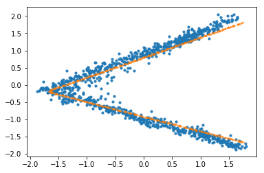


<a id='mlcupcv'></a>
### C. Training with best parameters obtained, with validation ([to top](#top))


```python
x=perceptron(**defaultParameters)
x.set_params(**bestParams)
x.fit(trainDataCup, trainLabelsCup, validationDataCup, validationLabelsCup, realTimePlotting=False)
```

    iteration 800/800


```python
plt.plot(x.losses)
plt.plot(x.validationLosses)
```


    [<matplotlib.lines.Line2D at 0x7fb4afb06748>]


<a id='blindtest'></a>
### D. Blind Test ([to top](#top))

<h3> predicting on model trained with cross validation


```python
blindPredictions=x.predict(blindFeatures)
```


```python
xx, yy=cutIt(blindPredictions)
xxx,yyy=cutIt(trainLabelsCup)
plt.scatter(xx,yy,alpha= 0.9, s = 10, marker='^')
plt.scatter(xxx,yyy, alpha= 0.5, s = 2)
```


    <matplotlib.collections.PathCollection at 0x7fb4ab2b8c50>


```python
regressionModel=perceptron(**defaultParameters)
regressionModel.set_params(**bestParams)
regressionModel.fit(trainDataCup, trainLabelsCup, realTimePlotting=False)
blindPredictions=regressionModel.predict(blindFeatures)
```

    iteration 800/800


```python
plt.plot(regressionModel.losses)
```


    [<matplotlib.lines.Line2D at 0x7fb4ab21f5f8>]


```python
blindPredictions=regressionModel.predict(blindFeatures)
```


```python
xx, yy=cutIt(blindPredictions)
xxx,yyy=cutIt(trainLabelsCup)
plt.scatter(xx,yy,alpha= 0.9, s = 10, marker='^')
plt.scatter(xxx,yyy, alpha= 0.5, s = 2)
```


    <matplotlib.collections.PathCollection at 0x7fb4123ee908>


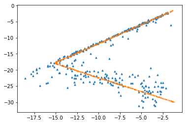

